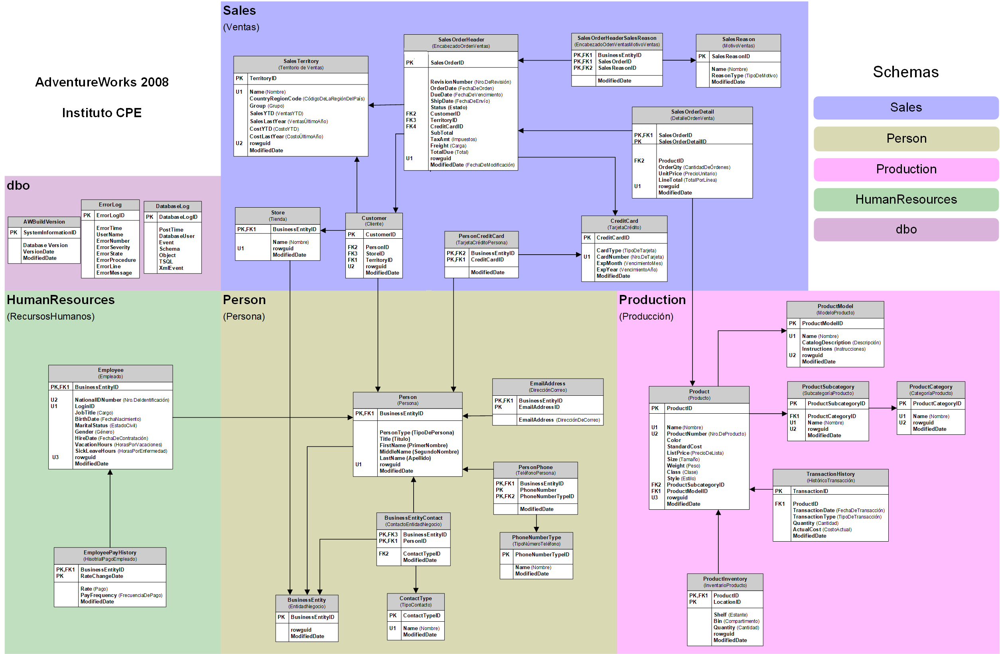

# SQL Analytics II — Avanzado

**Institución:** Instituto CPE — Conocer Para Transformar, Uruguay  
**Plataforma:** Moodle  
**Dialecto:** T-SQL / Microsoft SQL Server  
**Base de datos:** AdventureWorks2008  
**Examen obligatorio:** Mayo 2026

---

## Módulos del curso

| # | Módulo | Tema | Teoría | Práctico | Solución |
|---|--------|------|:------:|:--------:|:--------:|
| I | Subqueries | IN/NOT IN, ALL/ANY/SOME, EXISTS/NOT EXISTS | [PDF](teoria/pdf/modulo-01-subqueries.pdf) · [MD](teoria/markdown/01-subqueries.md) | [PDF](practicos/enunciados/practico-01-subqueries.pdf) | [SQL](practicos/resoluciones/practico-01-subqueries-solucion.sql) |
| II | DDL + DML | CREATE/DROP/ALTER TABLE, INSERT/UPDATE/DELETE | [PDF](teoria/pdf/modulo-02-ddl-dml.pdf) · [MD](teoria/markdown/02-ddl-dml.md) | [PDF](practicos/enunciados/practico-02-ddl-dml.pdf) | [SQL](practicos/resoluciones/practico-02-ddl-dml-solucion.sql) |
| III | Tablas Temporales | #Local, ##Global, scope y ciclo de vida | *(PDF no disponible)* · [MD](teoria/markdown/03-temp-tables.md) | [PDF](practicos/enunciados/practico-03-temp-tables.pdf) | [SQL](practicos/resoluciones/practico-03-temp-tables-solucion.sql) |
| IV | Views | CREATE/ALTER/DROP VIEW | [PDF](teoria/pdf/modulo-04-views.pdf) · [MD](teoria/markdown/04-views.md) | [PDF](practicos/enunciados/practico-04-views.pdf) | [SQL](practicos/resoluciones/practico-04-views-solucion.sql) |
| V | Variables | DECLARE, SET, scope local | [PDF](teoria/pdf/modulo-05-variables.pdf) · [MD](teoria/markdown/05-variables.md) | [PDF](practicos/enunciados/practico-05-variables.pdf) | [SQL](practicos/resoluciones/practico-05-variables-solucion.sql) |
| VI | Stored Procedures | Parámetros INPUT/OUTPUT, @@ERROR, RETURN | [PDF](teoria/pdf/modulo-06-stored-procedures.pdf) · [MD](teoria/markdown/06-stored-procedures.md) | [PDF](practicos/enunciados/practico-06-stored-procedures.pdf) | [SQL](practicos/resoluciones/practico-06-stored-procedures-solucion.sql) |
| VII | UDFs | Scalar Functions, Table-Valued Functions | [PDF](teoria/pdf/modulo-07-udfs.pdf) · [MD](teoria/markdown/07-udfs.md) | [PDF](practicos/enunciados/practico-07-udfs.pdf) | [SQL](practicos/resoluciones/practico-07-udfs-solucion.sql) |
| VIII | Window Functions | OVER, PARTITION BY, LAG/LEAD, RANK, NTILE | [PDF](teoria/pdf/modulo-08-window-functions.pdf) · [MD](teoria/markdown/08-window-functions.md) | [PDF](practicos/enunciados/practico-08-window-functions.pdf) | [SQL](practicos/resoluciones/practico-08-window-functions-solucion.sql) |
| IX | Performance Tips | Buenas prácticas, optimización de consultas | [PDF](teoria/pdf/modulo-09-performance-tips.pdf) · [MD](teoria/markdown/09-performance-tips.md) | *(sin práctico)* | — |

---

## Examen obligatorio

| Archivo | Descripción |
|---------|-------------|
| [Enunciado](examen/enunciado/obligatorio-mayo-2026.pdf) | 7 ejercicios, 100 puntos — Mayo 2026 |
| [Resolución](examen/resolucion/obligatorio-mayo-2026-solucion.sql) | Solución comentada (generada) |

### Distribución del examen

| Ejercicio | Tema | Puntos |
|-----------|------|--------|
| 1 | Tabla temporal `Vtas_Producto_Año` | 10 |
| 2 | UDF escalar `Variacion_Porc` | 15 |
| 3 | Vista con UDF, filtro Accessories | 10 |
| 4 | SP `QtyEmp_Vacation_Hours` (OUTPUT params) | 20 |
| 5 | Subquery: total anual cliente por fila | 10 |
| 6 | OVER: mismo resultado que Ex5 sin subquery | 15 |
| 7 | LAG: días entre compras consecutivas | 20 |

---

## Cheatsheets

| Archivo | Contenido |
|---------|-----------|
| [Subqueries](cheatsheets/subqueries-cheatsheet.md) | IN/NOT IN, EXISTS, correlated, scalar en SELECT |
| [Window Functions](cheatsheets/window-functions-cheatsheet.md) | OVER, PARTITION BY, LAG/LEAD, RANK, NTILE |
| [DDL + DML](cheatsheets/ddl-dml-cheatsheet.md) | CREATE, ALTER, DROP, INSERT, UPDATE, DELETE |
| [T-SQL vs PostgreSQL](cheatsheets/t-sql-vs-postgresql.md) | Equivalencias y diferencias de sintaxis |

---

## Schema de la base de datos



**Schemas principales usados en el curso:**

| Schema | Tablas clave |
|--------|-------------|
| `Sales` | SalesOrderHeader, SalesOrderDetail, Customer, SalesTerritory |
| `Production` | Product, ProductSubcategory, ProductCategory |
| `HumanResources` | Employee, EmployeePayHistory |
| `Person` | Person |

---

## Estructura del repositorio

```
sql-avanzado-moodle/
├── README.md
├── schema/
│   └── adventureworks2008.png
├── teoria/
│   ├── pdf/          ← PDFs originales del curso (CPE)
│   └── markdown/     ← Notas propias por módulo
├── practicos/
│   ├── enunciados/   ← PDFs de enunciados originales
│   ├── resoluciones/ ← Scripts SQL con soluciones comentadas
│   └── analisis/     ← Análisis de patrones y optimizaciones
├── examen/
│   ├── enunciado/
│   └── resolucion/
└── cheatsheets/
```

---

## Notas de dialecto

Los scripts de este repositorio están escritos en **T-SQL (SQL Server)**,
que es el dialecto requerido por el curso sobre AdventureWorks2008.
Ver [cheatsheets/t-sql-vs-postgresql.md](cheatsheets/t-sql-vs-postgresql.md)
para equivalencias con PostgreSQL.
